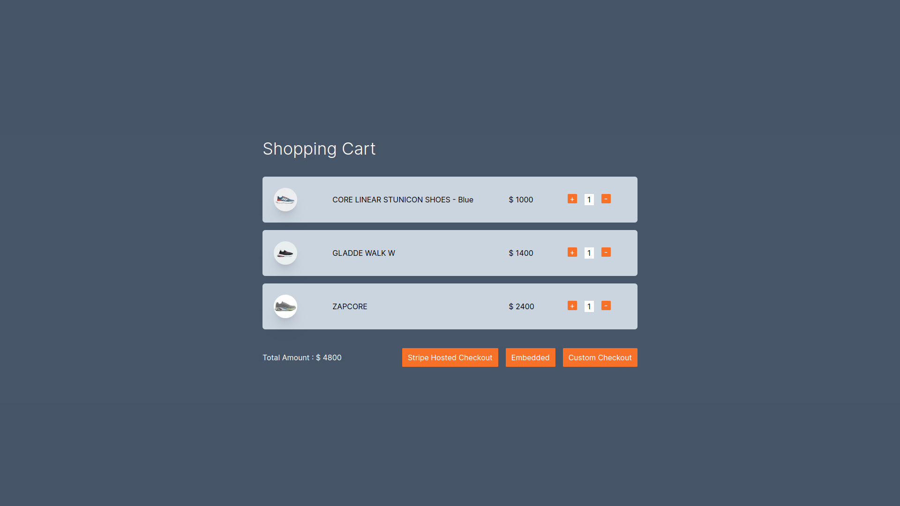

# Stripe Checkout Integration in NextJs

Here in this project i have implemented three ways to integrate stripe checkout in NextJs. Here is

- Redirect to Stripe-hosted payment page
- Embedded checkout page
- Custom flow

If you want to see the demo : [Live Link](https://stripe-payment-with-nextjs-demo.vercel.app/)

## Folder Structure

```
.
├── app
│   ├── api
│   │   ├── create-embedded-checkout-session
│   │   │   └── route.ts
│   │   ├── create-hosted-checkout-session
│   │   │   └── route.ts
│   │   ├── create-payment-intent
│   │   │   └── route.ts
│   │   └── session-status
│   │       └── route.ts
│   ├── custom-checkout
│   │   ├── canceled
│   │   │   └── page.tsx
│   │   ├── layout.tsx
│   │   ├── page.tsx
│   │   └── success
│   │       └── page.tsx
│   ├── embedded-checkout
│   │   ├── page.tsx
│   │   └── success
│   │       └── page.tsx
│   ├── favicon.ico
│   ├── globals.css
│   ├── layout.tsx
│   ├── page.tsx
│   └── stripe-hosted
│       ├── canceled
│       │   └── page.tsx
│       └── success
│           └── page.tsx
├── components
│   ├── address-form.tsx
│   ├── checkout-form.tsx
│   ├── checkout-items.tsx
│   └── shopping-cart.tsx
├── data
│   └── products.ts
├── next.config.mjs
├── next-env.d.ts
├── package.json
├── package-lock.json
├── postcss.config.mjs
├── public
│   ├── next.svg
│   └── vercel.svg
├── README.md
├── tailwind.config.ts
├── tsconfig.json
└── util
    ├── get-stripejs.ts
    └── index.ts

```

## Getting Started

1. clone this repo

```
  git clone https://github.com/kashyap27102/stripe-payment-with-nextjs-demo.git
```

2. run command `npm install`

3. To run this project, you will need to add the following environment variables to your .env file

   `NEXT_PUBLIC_STRIPE_PUBLISHABLE_KEY`

   `STRIPE_SECRET_KEY`

   `NEXT_PUBLIC_DOMAIN` : http://localhost:3000

- [Click here to get Keys.](https://dashboard.stripe.com/test/apikeys)

4. To start a project run command `npm run dev`

Here, I have make one demo shopping cart page from where you can chekckout to payment page

You can checkout to Payment by any of this three option among them.



Let's see steps to implement various methods

## 1) Redirect to Stripe-hosted payment page

#### Create a Checkout Session `server-side`

- Add an endpoint on your `server` that creates a Checkout Session
- Define a product to sell
  - First of all add product into stripe using api or [manually](https://dashboard.stripe.com/test/products?active=true&create=product&source=product_list)
- Checkout has three modes: `payment`, `subscription`, or `setup`. Use `payment` mode for one-time purchases.
- Supply success and cancel URLs : Specify URLs for success and cancel pages—make sure they’re publicly accessible so Stripe can redirect customers to them.

#### Redirect Your Customer to Stripe Checkout `client-side`

- Add a `checkout button` to your website that calls a server-side endpoint to create a Checkout Session
- After creating a Checkout Session, `redirect` your customer to the URL returned in the response.

see the full code below directory

- client

```
app
└── stripe-hosted
    ├── canceled
    │   └── page.tsx
    └── success
        └── page.tsx
```

- server

```
app
├── api
│   ├── create-hosted-checkout-session
│   │   └── route.ts
│   └── session-status
│       └── route.ts

```

## 2) Embedded Stripe Checkout Page

Embedded a pre-built payment form on your site using Stripe Checkout

#### Create a Checkout Session `server-side`

- Add an endpoint on your server that creates a Checkout Session.
- Set the `ui_mode` to `embedded` when you create the Checkout Session.

- A client secret is included in the Checkout Session response. The client uses that secret to mount Checkout. Return the `client_secret` in your response.

- To define how your customer is redirected after payment, specify the URL of the return page in the `return_url` parameter when you create the Checkout Session.
- After your customer attempts payment, Stripe redirects them to a return page that you host on your site.

  Include the `{CHECKOUT_SESSION_ID}` template variable in the URL. Checkout replaces the variable with the Checkout Session ID before redirecting your customer. You create and host the return page on your website.

#### Mount Checkout `client-side`

Install react-stripe-js and the Stripe.js loader from npm:

```
npm install --save @stripe/react-stripe-js @stripe/stripe-js
```

To use the Embedded Checkout component, create an EmbeddedCheckoutProvider. Call `loadStripe` with your publishable API key and pass the returned Promise to the provider.

#### Return Page `client-side`

- After your customer attempts payment, Stripe redirects them to a return page that you host on your site.

- When rendering your return page, retrieve the Checkout Session status using the `Checkout Session ID` in the URL.

Handle the result according to the session status as follows:

- `complete`: The payment succeeded. Use the information from the Checkout Session to render a success page.
- `open`: The payment failed or was cancelled. Remount Checkout so that your customer can try again.

see the full code below directory

- client

```
app
├── embedded-checkout
│   ├── page.tsx
│   └── success
│       └── page.tsx
```

- server

```
app
`├── api
│   ├── create-embedded-checkout-session
│   │   └── route.ts
│   └── session-status
│       └── route.ts
````

## 3) Custom Checkout Flow

Build a custom payments integration by embedding UI components on your site, using [Stripe Elements.](https://docs.stripe.com/payments/elements)

#### Create PaymentIntent `server-side`

- Create end-point at server side to create paymentIntent
- Stripe uses your payment methods settings to display the payment methods you have enabled.
- The PaymentIntent includes a `client secret` that the client side uses to securely complete the payment process.

#### Collect Payment Details `client-side`

- Collect payment details on the client with the [Payment Element](https://docs.stripe.com/payments/payment-element). [Click Here to learn other Elements](https://docs.stripe.com/stripe-js/react#available-element-components)
- The Payment Element is a pre-built UI component that simplifies collecting payment details for a variety of payment methods.
- To use the `Payment Element` component, wrap your checkout page component in an Elements provider.
- Add client-secret in option field which is receive from server.

#### submit the payment stripe

- Use `stripe.confirmPayment` to complete the payment using details from the Payment Element.
- Provide a `return_url` to this function to indicate where Stripe should redirect the user after they complete the payment.

see the full code below directory

- client

```
app
├── custom-checkout
│   ├── canceled
│   │   └── page.tsx
│   ├── layout.tsx
│   ├── page.tsx
│   └── success
│       └── page.tsx
```

- server

```
app
├── api
│   ├── create-payment-intent
│   │   └── route.ts
│   └── session-status
│       └── route.ts
```
